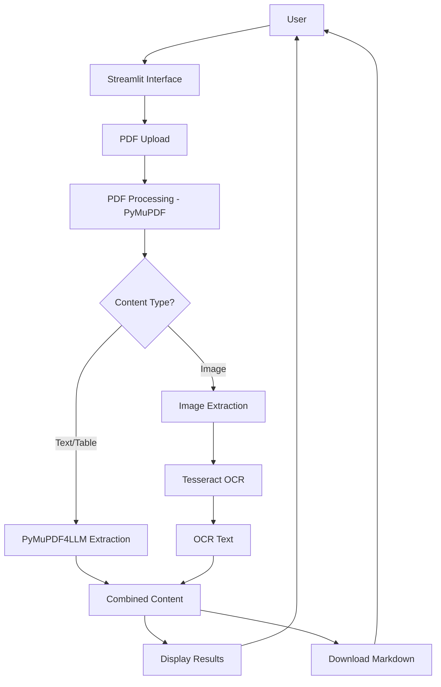

# PDF Extractor with OCR - Application Flow

## Overview
This document describes the programming flow and structure of the PDF Extractor application, which uses PyMuPDF4LLM and Tesseract OCR technologies to extract content from PDF files, including both text-based and image-based PDFs.

## File Structure
```
PyMuPDF4LLM/
├── .env
├── app_pymupdf4llm_tesseract.py
├── flow.md
└── output_tesseract/
    ├── extracted_content_DE.md
    └── extracted_content_EN.md
```

## Main Application Flow

### 1. Entry Point: `app_pymupdf4llm_tesseract.py`
- Main Streamlit application script that provides a web interface for PDF processing
- Integrates PyMuPDF4LLM for text/table extraction and Tesseract OCR for image-based text recognition
- Uses OpenCV and PIL for image processing

### 2. Configuration: `.env`
- Contains environment variables needed for the application (currently empty but available for future use)

### 3. Processing Pipeline

#### Step 1: User Interface
1. User uploads a PDF file through the Streamlit interface
2. User configures extraction options:
   - Enable/disable OCR for images
   - Select OCR language (English, German, French, etc.)
   - Choose table extraction strategy
   - Toggle page separators

#### Step 2: PDF Processing
1. Application reads the uploaded PDF file into memory
2. Uses PyMuPDF (fitz) to open and process the PDF document
3. Checks each page for existing text content
4. Identifies pages with images that may require OCR

#### Step 3: OCR Processing (if enabled)
1. For pages with images and no text, extracts images using PyMuPDF
2. Converts images to OpenCV format using PIL
3. Applies Tesseract OCR with selected language to extract text from images
4. Collects OCR-extracted text with page and image identifiers

#### Step 4: Text & Table Extraction
1. Uses PyMuPDF4LLM to extract text and tables from the PDF
2. Applies selected table strategy (lines_strict, lines, or text)
3. Optionally includes page separators in output

#### Step 5: Content Combination
1. Combines PyMuPDF4LLM extracted content with OCR extracted text
2. Handles different content types:
   - Text & tables from PyMuPDF4LLM
   - OCR extracted text from images
   - Raw text as fallback

#### Step 6: Output Generation
1. Displays extracted content in the Streamlit interface in categorized sections
2. Provides download button for combined markdown content

## Data Flow Diagram


## Dependencies
- Streamlit: Web application framework
- PyMuPDF4LLM: PDF text and table extraction library
- PyMuPDF (fitz): PDF processing library
- Tesseract OCR: Optical Character Recognition engine
- OpenCV (cv2): Image processing library
- PIL (Pillow): Python Imaging Library
- NumPy: Numerical computing library

## Usage Pattern
1. Run the application with `streamlit run app_pymupdf4llm_tesseract.py`
2. Upload a PDF file through the web interface
3. Configure extraction options as needed
4. View extracted content in the browser
5. Download the combined content as a markdown file

## Key Features
1. **Dual Extraction Approach**: Uses both PyMuPDF4LLM for text-based content and Tesseract OCR for image-based content
2. **Multi-language OCR**: Supports OCR in 10 languages
3. **Flexible Table Extraction**: Multiple strategies for table detection
4. **User-friendly Interface**: Streamlit-based web interface with configuration options
5. **Comprehensive Output**: Combines all extracted content into a single downloadable file

## Technical Implementation Details

### Image Processing Flow
1. Extract images from PDF using PyMuPDF's `get_images()` method
2. Convert PyMuPDF Pixmap to PNG bytes
3. Load image bytes into PIL Image
4. Convert PIL Image to OpenCV format
5. Apply Tesseract OCR to OpenCV image

### Error Handling
- Graceful handling of OCR failures with warnings
- Exception handling for PDF processing errors
- Warning messages for failed image processing

### Memory Management
- Proper cleanup of PyMuPDF Pixmap objects
- Closing PDF documents after processing
- Efficient handling of image data in memory

## Future Considerations
- Add support for additional OCR languages
- Implement batch processing for multiple documents
- Add advanced error handling and logging
- Create more detailed progress indicators
- Add support for password-protected PDFs
- Implement caching for better performance
- Add export options in additional formats (PDF, DOCX, etc.)